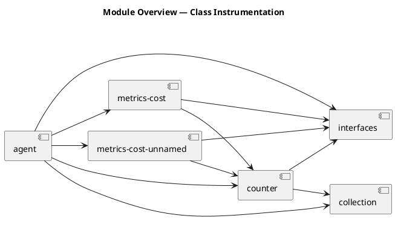
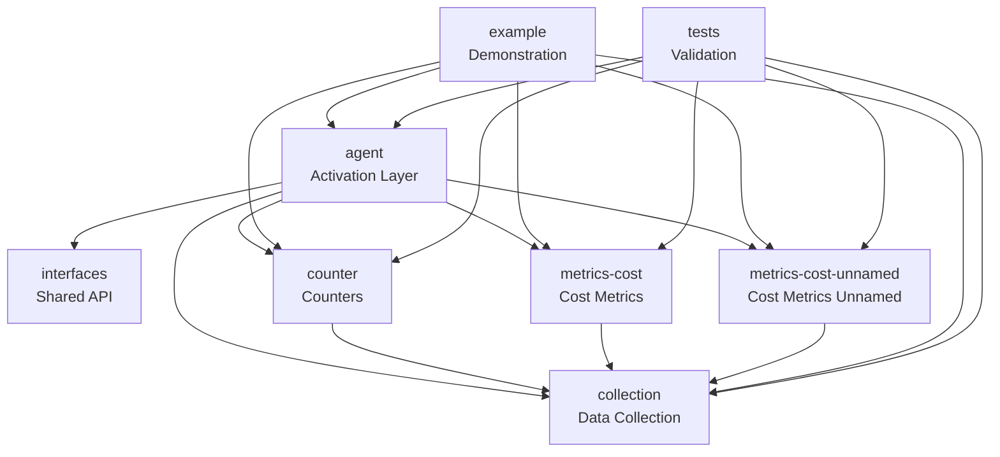
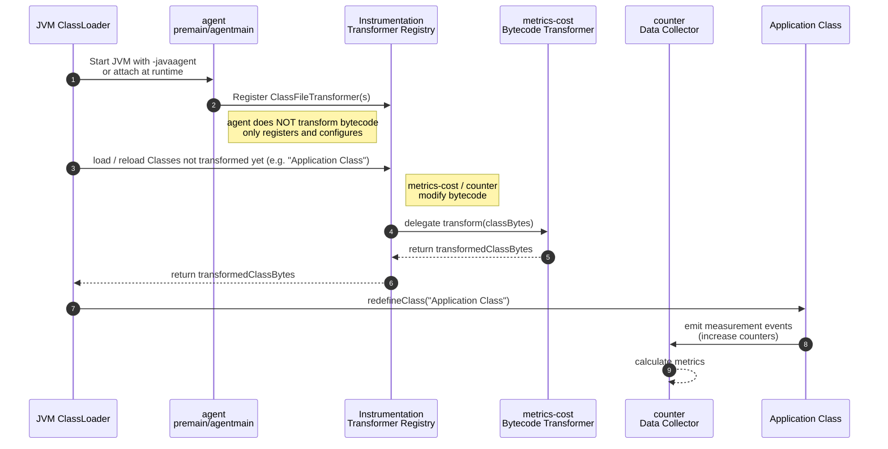

# Architecture Overview

This document provides a high‑level architectural overview of the runtime instrumentation framework.  
It summarizes the purpose of each module, shows how they interact, and includes diagrams to visualize the system.

For detailed responsibilities and boundaries, each module has its own `purpose.md` file.

---

# 📐 System Architecture

The system is composed of several independent but cooperating modules.  
Together, they implement a modular Java runtime instrumentation framework based on the JVM Instrumentation API.

---

# 🧩 Module Responsibilities (Summary)

| Module | Purpose |
|--------|---------|
| [`agent`](agent/purpose.md) | Activates and configures the instrumentation system (JVM agent entry point). |
| [`collection`](collection/purpose.md) | Collects and aggregates measurement data. |
| [`counter`](counter/purpose.md) | Implements runtime counters and injects counter logic. |
| [`interfaces`](interfaces/purpose.md) | Defines shared APIs and contracts. |
| [`metrics-cost`](metrics-cost/purpose.md) | Implements cost and timing measurement for JPMS modules. |
| [`metrics-cost-unnamed`](metrics-cost-unnamed/purpose.md) | Cost instrumentation for unnamed/classpath modules. |
| [`example`](example/purpose.md) | Demonstrates how instrumentation behaves in real code. |
| [`tests`](tests/purpose.md) | Validates correctness and stability of the instrumentation system. |

---

# 🔗 Module Dependency Diagram

# 🧭 Module Roles Diagram

# 🔧 Class Instrumentation Sequence

